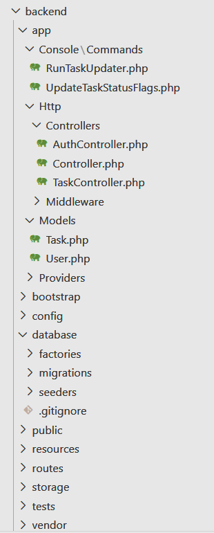

# 🧩 Task Manager Backend

Данный репозиторий содержит **серверную часть** приложения по управлению задачами. Сервер реализован с использованием **Laravel** — популярного PHP-фреймворка.

## 📦 Технологии
- PHP
- Laravel
- паттерн MVC (Model-View-Controller)

## 🧱 Архитектура проекта

Проект построен по классическому шаблону Laravel с разделением логики на модели, контроллеры и команды. Клиентская часть представлена отдельным React-приложением.

### Основные директории:

- `app/Console/Commands/` — консольные команды обновления статусов задач в зависимости от дедлайна.
- `app/Http/Controllers/` — контроллеры, отвечающие за обработку входящих HTTP-запросов.
- `app/Models/` — модели, описывающие основные сущности: `Task`, `User`.
- `routes/api.php` — определение API-эндпоинтов приложения.
- `database/` — миграции и фабрики для работы с БД.

### Примерные команды:
- `RunTaskUpdater.php` — запуск обновления задач.
- `UpdateTaskStatusFlags.php` — обновление статусов задач.

## 🔐 Тестовый аккаунт
- **Имя пользователя:** `php`  
- **Пароль:** `123`

## 🖼 Структура проекта

---

💡 Проект реализован в учебных целях и может служить основой для приложений по управлению задачами, расписаниями и другими сущностями со статусами и дедлайнами.
